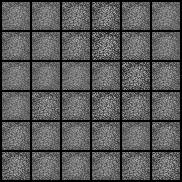

# gan-in-colab
GAN implementations on MNIST Dataset in Google Colab

### Generative Adversarial Networks

Paper: https://arxiv.org/pdf/1406.2661.pdf  
300 epochs:  

### DCGAN

Paper: https://arxiv.org/pdf/1511.06434.pdf

The given learning rate in the paper (0.0002) made it collapse too hard so I used 0.00005 instead.  
10 Epochs:  

### Conditional GAN  

Paper: https://arxiv.org/pdf/1411.1784.pdf  
Additionally to the paper, in order to avoid collapsing modes I used soft labeling ranging between 0-0.1 for fakes and 0.9-1.1 for real images. This range has been decreased over epochs and converged to 0 and to 1 in epoch 100 respectively.  

